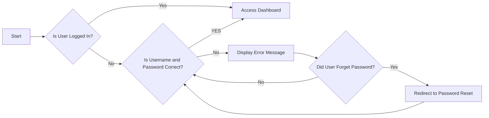
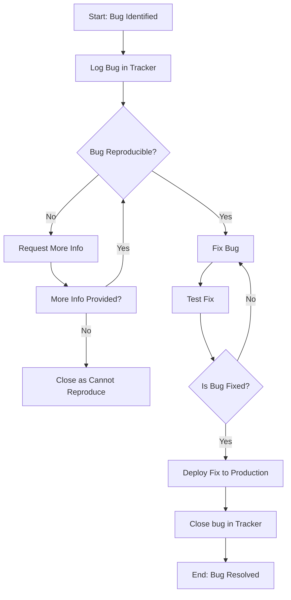
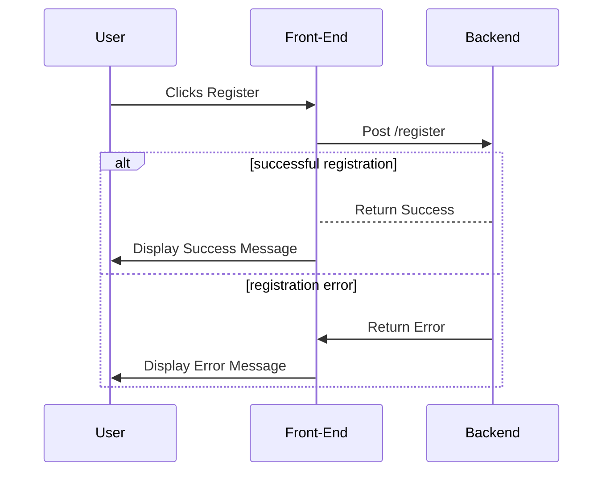
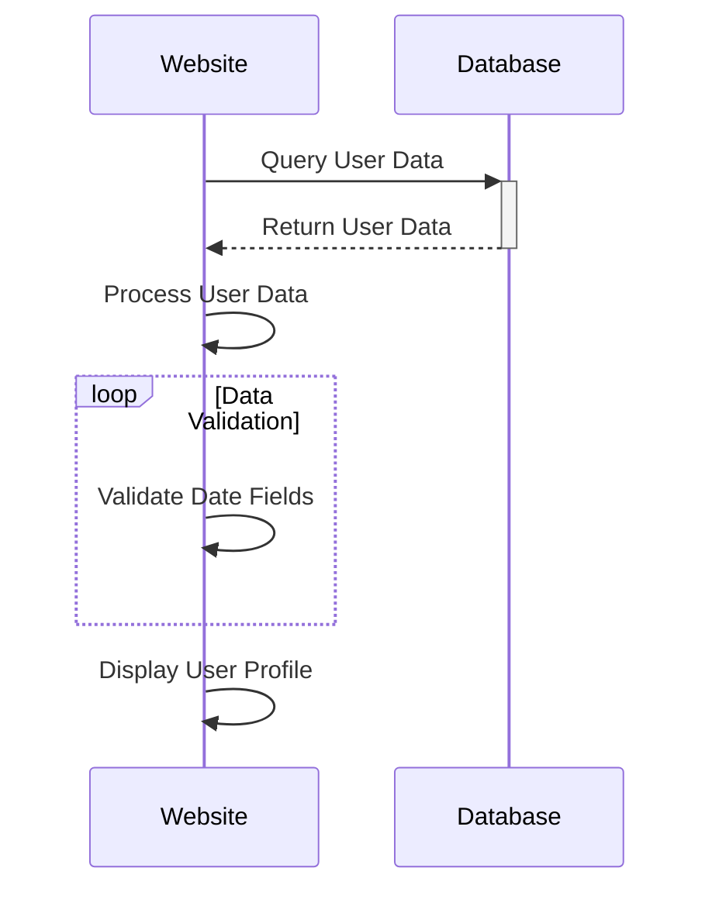

# Mermaid Example Diagrams

### User Login Flowchart

```mermaid
flowchart LR
A[Start] --> B{Is User Logged In?}
B -->|Yes| C[Access Dashboard]
B -->|No| D{Is Username and Password Correct?}
D -->|YES| C
D -->|No| E[Display Error Message]
E --> F{Did User Forget Password?}
F -->|Yes| G[Redirect to Password Reset]
F -->|No| D
G --> D
```

### Software Development Process Flowchart

```mermaid
flowchart
    A[Start: Bug Identified] --> B[Log Bug in Tracker]
    B --> C{Bug Reproducible?}
    C -->|Yes| D[Fix Bug]
    C -->|No| E[Request More Info]
    E --> F[More Info Provided?]
    F -->|Yes| C
    F -->|No| G[Close as Cannot Reproduce]
    D --> H[Test Fix]
    H --> I{Is Bug Fixed?}
    I -->|Yes| J[Deploy Fix to Production]
    I -->|No| D
    J --> K[Close bug in Tracker]
    K --> L[End: Bug Resolved]
```

### Sequence Diagram-User Registration Process

```mermaid
sequenceDiagram
participant U as User
participant F as Front-End
participant B as Backend
U->>F: Clicks Register
F->>B: Post /register
alt successful registration
    B-->F: Return Success
    F->>U: Display Success Message
else registration error
    B->>F: Return Error
    F->>U: Display Error Message
end
```

### Sequence Diagram-Website Querying DB

```mermaid
sequenceDiagram
participant W as Website
participant D as Database
W->>+D: Query User Data
D-->>-W: Return User Data
W->>W: Process User Data
loop Data Validation
W->>W: Validate Date Fields
end
W->>W: Display User Profile
```
